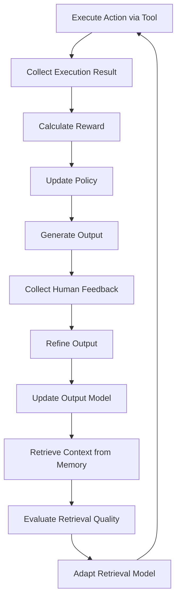

# Agentic AI Adaptation Analysis for AI SDM Agent

## 📋 Source Repository
**Repository**: [Awesome-Adaptation-of-Agentic-AI](https://github.com/suh004757/Awesome-Adaptation-of-Agentic-AI)  
**Analysis Date**: 2026-01-31  
**Purpose**: Identify relevant adaptation patterns for AI SDM Agent development

---

## 🎯 Repository Taxonomy Overview

The repository categorizes Agentic AI adaptation into two main dimensions:

### 1️⃣ Agent Adaptation
How agents learn and improve their decision-making capabilities

#### **A1: Tool Execution Signaled Agent Adaptation**
- **Definition**: Agent learns from the **results of tool execution**
- **Signal Source**: Tool execution outcomes, success/failure feedback
- **Learning Methods**:
  - **RL-based Methods**: Reinforcement learning from tool execution rewards
  - **SFT & DPO Methods**: Supervised fine-tuning and Direct Preference Optimization

#### **A2: Agent Output Signaled Agent Adaptation**
- **Definition**: Agent learns from its **own output quality**
- **Signal Source**: Output evaluation, reasoning quality, final results
- **Categories**:
  - **Methods with Tools**: Agents that use external tools and learn from combined outcomes
  - **Methods without Tools**: Pure reasoning/generation improvement

---

### 2️⃣ Tool Adaptation
How tools evolve to better serve agents

#### **T1: Agent-Agnostic Tool Adaptation**
- **Definition**: Tools that work independently of specific agents
- **Examples**: CLIP, SAM, Whisper, AlphaFold
- **Characteristics**: General-purpose, pre-trained, plug-and-play

#### **T2: Agent-Supervised Tool Adaptation**
- **Definition**: Tools that adapt based on agent feedback
- **Learning**: Tools improve through agent supervision and interaction
- **Examples**: Retrieval models, specialized adapters, memory systems

---

## 🔗 Relevance to AI SDM Agent Project

### High Relevance Areas

#### 1. **A1: Tool Execution Signaled** → **Decision Engine (Section 3)**
**Why Relevant:**
- AI SDM Agent will execute actions via APIs (Jira, Azure, Teams)
- Tool execution results provide direct feedback signals
- Can learn which actions lead to successful outcomes

**Application to AI SDM:**
```python
# Example: Learning from task assignment outcomes
action = "assign_task(task_id=123, assignee='DevA')"
execution_result = jira_api.assign_task(...)

if execution_result.success:
    if task_completed_on_time(task_id=123):
        reward = +1.0  # Successful assignment
    else:
        reward = -0.5  # Assignment didn't help
else:
    reward = -1.0  # API call failed

# Update policy based on reward
update_assignment_policy(context, action, reward)
```

**Recommended Papers from Repository:**
- **DeepSeek-Prover-V2** (RL-based): Advanced reasoning with tool execution
- **FTRL** (ByteDance): Fast Tool-use Reinforcement Learning
- **Agent-R** (ByteDance): Agent learning from tool execution feedback

---

#### 2. **A2: Agent Output Signaled (Methods with Tools)** → **Reporting & Explainability (Section 6)**
**Why Relevant:**
- AI SDM generates reports, risk assessments, recommendations
- Output quality can be evaluated by humans (Human-in-the-Loop)
- Self-refinement based on stakeholder feedback

**Application to AI SDM:**
```python
# Example: Learning from report quality feedback
report = generate_weekly_status_report(project)
human_feedback = await_stakeholder_review(report)

if human_feedback.rating >= 4.0:
    reward = +1.0
    save_as_positive_example(report)
elif human_feedback.rating < 2.0:
    reward = -1.0
    analyze_failure_mode(report, human_feedback.comments)

# Self-refinement
if human_feedback.corrections:
    refined_report = refine_report(report, human_feedback.corrections)
    learn_from_correction(original=report, corrected=refined_report)
```

**Recommended Papers from Repository:**
- **Self-RAG**: Self-reflective retrieval-augmented generation
- **Agent-Lightning** (Microsoft): Fast agent adaptation from output signals
- **AutoRefine**: Automatic refinement based on output evaluation

---

#### 3. **T2: Agent-Supervised Tool Adaptation** → **Context Memory (Section 2.5)**
**Why Relevant:**
- AI SDM needs retrieval tools for past project knowledge
- Retrieval quality improves as agent learns what information is useful
- Memory systems adapt based on agent's information needs

**Application to AI SDM:**
```python
# Example: Adaptive retrieval for decision-making
query = "How did we handle similar delay in past projects?"
retrieved_cases = vector_db.search(query, top_k=5)

# Agent evaluates retrieval quality
decision = make_decision_with_context(current_situation, retrieved_cases)
decision_quality = evaluate_decision_outcome(decision)

if decision_quality > threshold:
    # Retrieval was helpful, reinforce this pattern
    update_retrieval_model(query, retrieved_cases, reward=+1.0)
else:
    # Retrieval wasn't helpful, adjust
    update_retrieval_model(query, retrieved_cases, reward=-0.5)
```

**Recommended Papers from Repository:**
- **AAR** (Augmentation-Adapted Retriever): Retrieval adapts to agent needs
- **LLM-Retriever** (Microsoft): Retrieval model supervised by LLM agent
- **Proxy-Tuning**: Efficient adaptation of retrieval tools

---

### Medium Relevance Areas

#### 4. **A2: Methods without Tools** → **Heuristic Playbook (Section 3.2)**
**Why Relevant:**
- Pure reasoning improvement without external tools
- Self-refinement of decision logic
- Learning from reasoning traces

**Application to AI SDM:**
- Improve quality of risk assessment reasoning
- Refine escalation decision logic
- Self-correct planning errors

**Recommended Papers:**
- **Self-Refine**: Iterative self-improvement of outputs
- **TextGrad**: Gradient-based optimization of text reasoning
- **RISE**: Reasoning improvement through self-evaluation

---

#### 5. **T1: Agent-Agnostic Tools** → **Data Ingestion (Section 2.1)**
**Why Relevant:**
- Pre-built tools that AI SDM can leverage
- No need to train from scratch
- Plug-and-play integration

**Application to AI SDM:**
- Use existing embedding models (E5, Contriever) for semantic search
- Leverage pre-trained models for sentiment analysis
- Integrate general-purpose APIs

---

## 📊 Implementation Priority Matrix

| Adaptation Type | AI SDM Section | Priority | Complexity | Impact |
|-----------------|----------------|----------|------------|--------|
| **A1: Tool Execution Signaled** | 3.1 Rule Engine, 4.1 Task Control | 🔴 High | Medium | High |
| **A2: Output Signaled (with Tools)** | 6.1 Auto Reporting, 6.2 Explainability | 🔴 High | Medium | High |
| **T2: Agent-Supervised Adaptation** | 2.5 Context Memory | 🟡 Medium | High | Medium |
| **A2: Output Signaled (no Tools)** | 3.2 Heuristic Playbook | 🟡 Medium | Low | Medium |
| **T1: Agent-Agnostic Tools** | 2.1 Data Ingestion | 🟢 Low | Low | Low |

---

## 🚀 Recommended Implementation Roadmap

### Phase 1: Foundation (Months 1-3)
**Focus**: A1 - Tool Execution Signaled

```markdown
1. Implement basic tool execution logging
   - Track all API calls (Jira, Azure, Teams)
   - Log execution results (success/failure)
   - Record context (project state, inputs, outputs)

2. Build reward model
   - Define success criteria for each action type
   - Implement delayed reward (e.g., task completion after assignment)
   - Create feedback collection mechanism

3. Start simple RL loop
   - Use bandit algorithms for action selection
   - Gradually introduce contextual bandits
   - Log all decisions for offline learning
```

**Key Papers to Study:**
- FTRL (ByteDance): Practical RL for tool use
- Agent-R (ByteDance): Agent learning framework

---

### Phase 2: Quality Improvement (Months 4-6)
**Focus**: A2 - Agent Output Signaled

```markdown
1. Implement output quality evaluation
   - Collect human feedback on reports
   - Build automated quality metrics (clarity, accuracy, completeness)
   - Create feedback loop for self-refinement

2. Self-refinement pipeline
   - Generate initial output
   - Self-evaluate using quality criteria
   - Iteratively refine until threshold met
   - Learn from human corrections

3. Preference learning
   - Collect stakeholder preferences
   - Build preference model (DPO-style)
   - Adapt communication style per stakeholder
```

**Key Papers to Study:**
- Self-RAG: Self-reflective generation
- AutoRefine: Automatic refinement
- Agent-Lightning (Microsoft): Fast adaptation

---

### Phase 3: Memory & Context (Months 7-9)
**Focus**: T2 - Agent-Supervised Tool Adaptation

```markdown
1. Adaptive retrieval system
   - Build vector database for past decisions
   - Implement retrieval quality feedback
   - Train retrieval model to adapt to agent needs

2. Memory consolidation
   - Identify frequently retrieved patterns
   - Create memory abstractions (e.g., "common delay patterns")
   - Update memory based on usage

3. Tool improvement loop
   - Monitor which tools are most/least helpful
   - Adapt tool parameters based on outcomes
   - Retire or replace underperforming tools
```

**Key Papers to Study:**
- AAR (Augmentation-Adapted Retriever)
- LLM-Retriever (Microsoft)
- Memento: Memory-augmented agents

---

## 🔬 Specific Techniques to Adopt

### 1. **Reinforcement Learning from Tool Execution**
**From**: DeepSeek-Prover-V2, FTRL

```python
class ToolExecutionRL:
    def __init__(self):
        self.policy = PolicyNetwork()
        self.value_function = ValueNetwork()
        self.replay_buffer = ReplayBuffer()
    
    def execute_with_learning(self, state, available_actions):
        # Select action using policy
        action = self.policy.select_action(state, available_actions)
        
        # Execute tool
        result = execute_tool(action)
        
        # Calculate reward
        immediate_reward = result.success ? 1.0 : -1.0
        delayed_reward = await_outcome_evaluation(action)
        total_reward = immediate_reward + 0.9 * delayed_reward
        
        # Store experience
        self.replay_buffer.add(state, action, total_reward, next_state)
        
        # Update policy
        if len(self.replay_buffer) > batch_size:
            self.update_policy()
        
        return result
```

---

### 2. **Self-Refinement with Feedback**
**From**: Self-Refine, AutoRefine

```python
class SelfRefiningReporter:
    def generate_report(self, project_data, max_iterations=3):
        report = self.initial_generation(project_data)
        
        for iteration in range(max_iterations):
            # Self-evaluate
            quality_score = self.evaluate_quality(report)
            
            if quality_score > self.threshold:
                break
            
            # Identify weaknesses
            weaknesses = self.identify_weaknesses(report)
            
            # Refine
            report = self.refine(report, weaknesses)
        
        return report
    
    def evaluate_quality(self, report):
        criteria = {
            "clarity": self.check_clarity(report),
            "completeness": self.check_completeness(report),
            "accuracy": self.check_accuracy(report),
            "actionability": self.check_actionability(report)
        }
        return weighted_average(criteria)
```

---

### 3. **Adaptive Retrieval**
**From**: AAR, LLM-Retriever

```python
class AdaptiveRetriever:
    def __init__(self):
        self.retriever = DenseRetriever()
        self.usage_tracker = UsageTracker()
    
    def retrieve_with_adaptation(self, query, context):
        # Retrieve candidates
        candidates = self.retriever.search(query, top_k=10)
        
        # Agent evaluates relevance
        relevant_docs = self.agent_filter(candidates, context)
        
        # Track which documents were actually useful
        self.usage_tracker.record(query, candidates, relevant_docs)
        
        # Periodically update retriever
        if self.usage_tracker.should_update():
            self.update_retriever()
        
        return relevant_docs
    
    def update_retriever(self):
        # Get positive and negative examples
        positive_pairs = self.usage_tracker.get_positive_pairs()
        negative_pairs = self.usage_tracker.get_negative_pairs()
        
        # Fine-tune retriever
        self.retriever.fine_tune(positive_pairs, negative_pairs)
```

---

## 📚 Top 10 Papers to Study

### Immediate Priority (Next 2 Weeks)

1. **Agent-R** (ByteDance, 2025)
   - Comprehensive agent learning framework
   - Direct application to AI SDM

2. **FTRL** (ByteDance, 2025)
   - Fast Tool-use Reinforcement Learning
   - Practical RL for tool execution

3. **Self-RAG** (2023)
   - Self-reflective retrieval-augmented generation
   - Foundation for self-improvement

### Medium Priority (Next Month)

4. **Agent-Lightning** (Microsoft, 2025)
   - Fast agent adaptation from output signals
   - Efficient learning methods

5. **AutoRefine** (2025)
   - Automatic refinement based on evaluation
   - Self-improvement without human feedback

6. **AAR** (Augmentation-Adapted Retriever, 2023)
   - Retrieval adaptation to agent needs
   - Memory system improvement

### Long-term Study (Next Quarter)

7. **DeepSeek-Prover-V2** (2025)
   - Advanced RL for complex reasoning
   - State-of-the-art tool use

8. **Memento** (2025)
   - Memory-augmented agent systems
   - Long-term context management

9. **LLM-Retriever** (Microsoft, 2023)
   - Retrieval model supervised by LLM
   - Tool adaptation patterns

10. **TextGrad** (2024)
    - Gradient-based optimization of reasoning
    - Pure reasoning improvement

---

## 🎯 Key Takeaways for AI SDM Agent

### 1. **Start with Tool Execution Feedback (A1)**
- Easiest to implement
- Clear reward signals from API results
- Immediate value (better action selection)

### 2. **Add Output Quality Learning (A2)**
- Human feedback on reports is gold
- Self-refinement reduces human review burden
- Builds trust through explainability

### 3. **Invest in Adaptive Memory (T2)**
- Long-term competitive advantage
- Organizational knowledge compounds over time
- Retrieval quality directly impacts decision quality

### 4. **Don't Reinvent Tools (T1)**
- Use existing models (embeddings, sentiment analysis)
- Focus on adaptation, not creation
- Faster time to value

---

## 🔄 Continuous Learning Loop



---

## 📝 Next Steps

### Immediate Actions (This Week)
1. ✅ Read Agent-R and FTRL papers
2. ✅ Design tool execution logging schema
3. ✅ Prototype simple reward model for task assignment

### Short-term (Next Month)
1. Implement basic RL loop for one action type (e.g., task priority adjustment)
2. Build report quality evaluation framework
3. Set up human feedback collection pipeline

### Medium-term (Next Quarter)
1. Expand RL to all action types
2. Implement self-refinement for reports
3. Build adaptive retrieval system

---

**Version**: 1.0  
**Last Updated**: 2026-01-31  
**Maintained by**: AI SDM Project Team  
**Source**: [Awesome-Adaptation-of-Agentic-AI](https://github.com/suh004757/Awesome-Adaptation-of-Agentic-AI)
